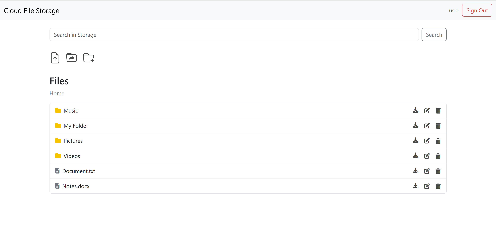

# Cloud File Storage

## Overview

Cloud File Storage is a web application inspired by Google Drive that allows users to upload and store files.

## Technologies

- **Java 21**
- **Spring Boot 3.3.5**
- **Spring Security**
- **Spring MVC**
- **Spring Data JPA**
- **Spring Sessions**
- **PostgreSQL**
- **Flyway**
- **Redis**
- **MinIO**
- **Docker / Docker Compose**
- **Testcontainers**
- **JUnit 5**
- **Thymeleaf**
- **JavaScript**
- **Bootstrap**
- **HTML**
- **CSS**
- **Gradle**
- **Passay**
- **Lombok**

## Interface

- **Sign Up Page**:
  

- **Sign In Page**:
  

- **Home Page**:
  

- **Search Page**:
  

## Local project startup

To start the project locally, use the provided [docker-compose.yml](docker-compose.yml) file. This setup is intended for
development and testing purposes on a local machine.

### Key Points:
- **Dockerized Services**: Includes containers for PostgreSQL, MinIO, and Redis.
- **Java-Based Application**: Built using Java 21.

### Prerequisites
- **Docker** and **Docker Compose** installed.
- **Java 21** or a compatible runtime environment.

### Steps to Run the project locally:

1. **Start Docker Containers**
   - Open your terminal in the project's root directory.
   - Start the required containers in detached mode using the following command:
     ```bash
     docker-compose up -d
     ```
   - Verify that the containers are running:
     ```bash
     docker ps
     ```

2. **Run the Application**
   - **Option 1: Using IntelliJ IDEA**
      - Open the project in IntelliJ IDEA.
      - Run the main application class (`com/asalavei/cloudfilestorage/CloudFileStorageApplication`).
   - **Option 2: Running the JAR File**
      - Build the JAR file:
         ```bash
         # For Windows
         .\gradlew.bat build
         # For Linux/MacOS
         ./gradlew build
         ```
      - Navigate to the build folder:
         ```bash
         cd build/libs
         ```
      - Run the application:
         ```bash
         java -jar cloud-file-storage-0.0.1-SNAPSHOT.jar
         ```

3. **Access the Application**
   - Open a browser and navigate to: `http://localhost:8080/`.


## Deployment

For server deployment, use the [docker-compose-prod.yml](docker-compose-prod.yml) file.

### Key Points:
- **Production-Ready Configuration**: Includes containers for the application, PostgreSQL, MinIO, and Redis.

### Prerequisites
- **Docker** and **Docker Compose** installed on the server.

### Deployment Steps

1. Copy the `docker-compose-prod.yml` and `.env.prod` files to your server.
2. On the server, navigate to the directory containing the `docker-compose-prod.yml` file.
3. Run the following command to start the containers in detached mode:
   ```bash
   docker-compose -f docker-compose-prod.yml up -d
4. Confirm the containers are running:
     ```bash
     docker ps
     ```

## Contributing

Contributions are welcome! Please fork this repository and submit a pull request

## License

This project is licensed under the MIT License. See the [LICENSE](LICENSE) file for details.